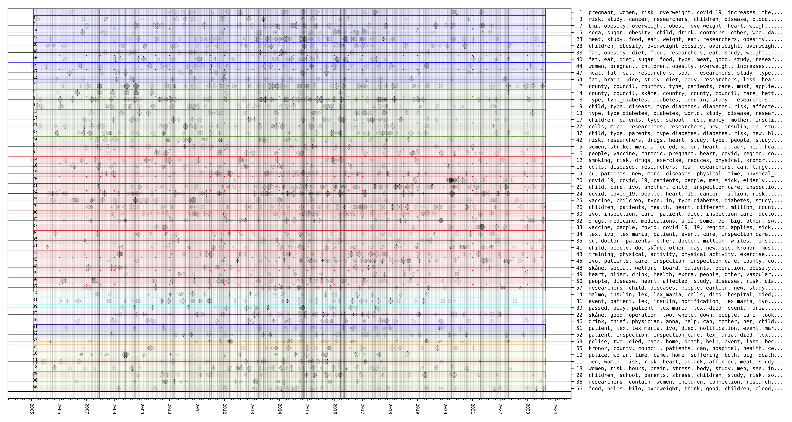
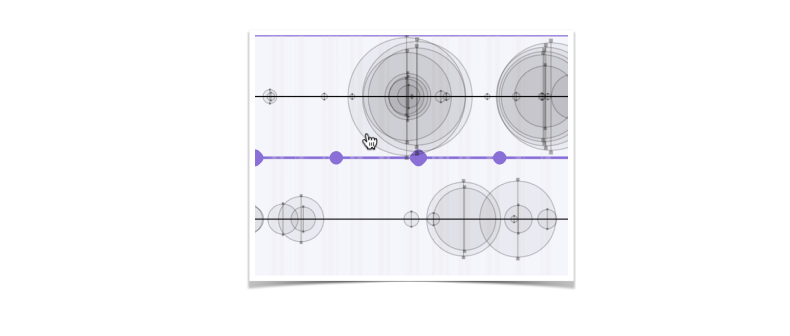

Topic Timelines
===============
This timeline visualises the prevalence of topics over time in a temporal corpus, as well as the prominence of the topics in the texts. 

The following examplifies the timeline visualisation for a corpus consisting of Swedish news about diabetes. The y-axis shows topics that have been automatically extracted from the corpus and the x-axis shows the date associated with the texts in the corpus. Each text is represented by a vertical line. The circles represent the level of association between the topic and the text. The larger the circle, the closer the association. Many overlapping circles at a certain date indicates that many texts on this topic were published this date. 

It is possible to associate a unique hyperlink with each text that has been used for generating the timeline. The circles then become clickable links, which direct you to the web page associated with the text, for instance a web page that contains the text with its original layout. It is thereby possible to use the visualisation as a tool for locating and selecting potentially interesting texts for close reading.

Code examples
-------------

Here is a code example for how to generate the topics using sentence transformers.

Here is a code examples for how to generate timelines for the topics extracted with the previous code.

Comments
--------
This is a temporary repository for paper submission. A new version will be provided.

